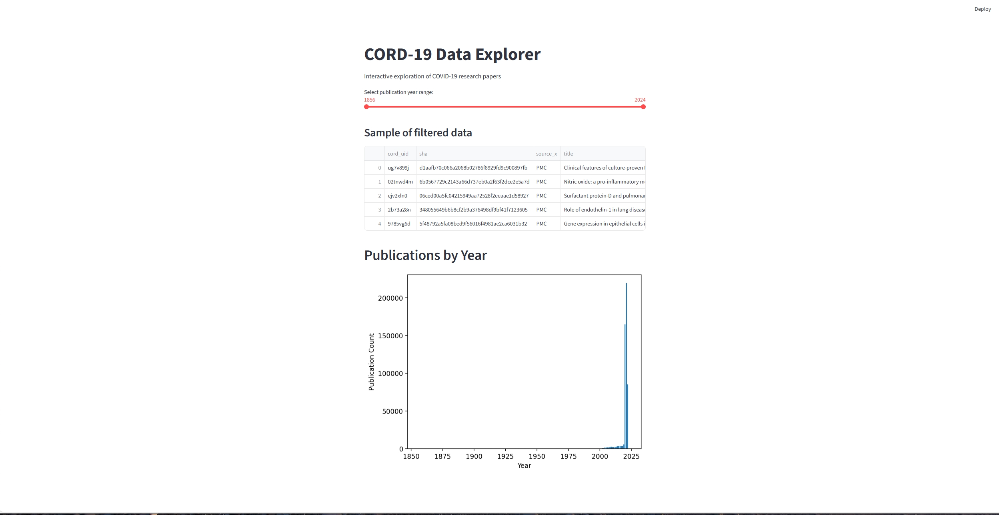
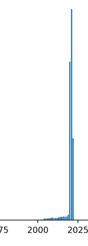

# 📘 **CORD-19 Data Explorer**  
*A Data Analysis + Streamlit Web App Project*

[]()  
[]()  
[]()  
[]()

---

## 📑 **Table of Contents**
1. [Overview](#overview)  
2. [Project Features](#project-features)  
3. [Repository Structure](#repository-structure)  
4. [Dataset Information](#dataset-information)  
5. [Installation](#installation)  
6. [How to Run](#how-to-run)  
7. [Screenshots](#screenshots)  
8. [Future Improvements](#future-improvements)  
9. [Author](#author)

---

## 🧠 **Overview**

This project explores the **CORD-19 COVID-19 Research Dataset**, performs data cleaning and analysis using pandas, and presents interactive visualizations using **Streamlit**.

The goal is to demonstrate:

- Basic data exploration  
- Handling missing data  
- Generating visual insights  
- Building a simple interactive UI with Streamlit  

This assignment showcases a full beginner-friendly data science workflow.

---

## 🚀 **Project Features**

### 🔍 Data Analysis  
✔️ Load and inspect the metadata  
✔️ Clean missing data  
✔️ Convert publication dates  
✔️ Extract publication year  
✔️ Analyze top journals  
✔️ Analyze title word frequency  
✔️ Visualize trends

### 🖥️ Streamlit App  
✔️ Year range slider  
✔️ Filtered data table  
✔️ Bar chart of publications  
✔️ Interactive UI  

---

## 📁 **Repository Structure**

```
Frameworks_Assignment/
│── analysis.ipynb        # Jupyter Notebook with analysis
│── app.py                # Streamlit application
│── README.md             # Project documentation
│── metadata_sample.csv   # (Optional small sample if added later)
```

---

## 📊 **Dataset Information**

The dataset used is the **CORD-19 Research Challenge metadata**:

📦 Contains:  
- Titles  
- Authors  
- Abstracts  
- Source + journal  
- Publication dates  
- Paper IDs  

❗ **The full dataset is ~1.6GB** and cannot be uploaded to GitHub.

Instead, download the metadata here:

🔗 **https://www.kaggle.com/allen-institute-for-ai/CORD-19-research-challenge**

Then place `metadata.csv` in the project folder next to `app.py`.

---

## ⚙️ **Installation**

Install required packages:

```
pip install pandas matplotlib seaborn streamlit
```

If using Python 3.10 explicitly:

```
py -3.10 -m pip install pandas matplotlib seaborn streamlit
```

---

## ▶️ **How to Run**

### 1. Make sure `metadata.csv` is in the same folder as `app.py`.

### 2. Run the Streamlit app:

```
streamlit run app.py
```

or, for Python 3.10:

```
py -3.10 -m streamlit run app.py
```

### 3. Open the app in your browser:

```
http://localhost:8501
```

---

## 📸 Screenshots

### 🔹 Homepage


### 🔹 Publications Chart


```

---

## 🔮 **Future Improvements**

- Add word cloud visualization  
- Add filters by journal  
- Add abstract keyword search  
- Add more charts & graphs  
- Deploy Streamlit app online  
- Add caching for faster performance  

---

## 📝 **Author**

**Fatima-Zahra — Frameworks Assignment (2025)**  
Built for data analysis & Python learning.
